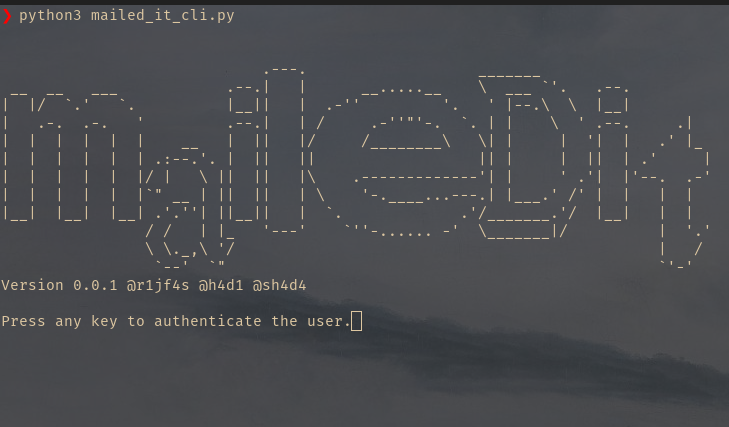

<!-- PROJECT LOGO -->
<br />
<p align="center">
  <a href="https://github.com/hadibinnoor/SHN-GmailAPI">
    
  </a>

  <h3 align="center">Mailed It</h3>

  <p align="center">
    Simple python based CLI tool to mass mail using template mail!
    <br />
    <a href="https://github.com/hadibinnoor/SHN-GmailAPI"><strong>Explore the docs »</strong></a>
    <br />
    <br />
    <a href="https://github.com/hadibinnoor/SHN-GmailAPI/issues">Report Bug</a>
    ·
    <a href="https://github.com/hadibinnoor/SHN-GmailAPI/issues">Request Feature</a>
  </p>
</p>

<!-- TABLE OF CONTENTS -->
<details open="open">
  <summary>Table of Contents</summary>
  <ol>
    <li>
      <a href="#about-the-project">About The Project</a>
      <ul>
        <li><a href="#built-with">Built With</a></li>
      </ul>
    </li>
    <li>
      <a href="#getting-started">Getting Started</a>
      <ul>
        <li><a href="#prerequisites">Prerequisites</a></li>
        <li><a href="#installation">Installation</a></li>
      </ul>
    </li>
    <li><a href="#usage">Usage</a></li>
    <li><a href="#roadmap">Roadmap</a></li>
    <li><a href="#contributing">Contributing</a></li>
    <li><a href="#license">License</a></li>
    <li><a href="#contact">Contact</a></li>
    <li><a href="#contributers">Contributers</a></li>
  </ol>
</details>

<!-- ABOUT THE PROJECT -->

## About The Project

### CLI Example

---



<br>
<br>

### Built With

The project is built with core google libraries for python.

- [Python](https://www.python.org/)
- [GmailAPI](https://developers.google.com/gmail/api)

<!-- GETTING STARTED -->

## Getting Started

Follow the below steps to run the cli tool.

### Prerequisites

You must have a google cloud account with a project containing Gmail API enabled. [Learn More](https://developers.google.com/workspace/guides/create-credentials)

### Installation

1. Clone the repo
   ```sh
   git clone https://github.com/hadibinnoor/SHN-GmailAPI.git
   ```
2. Install required packages
   ```sh
   pip install -r requirements.txt
   ```
3. Enable gmail API and gets the credentials.json and save it as credentials.json.
4. Create a template.txt file with email template
   Eg:
   ```
    i'm {name} and i'm {age} years old
   ```
5. Add csv data file to load data from (eg data.csv)
   Eg:
   ```
    email,name,age
    rijfas@gmail.com,rijfas,20
    shadafathima@gmail.com,shada,18
   ```
6. Run the mailed_it_cli.py using
   ```sh
   python mailed_it_cli.py
   ```

<!-- USAGE EXAMPLES -->

## Usage


### Using the CLI

1. Run mailed_it_cli.py
   ```sh
   python mailed_it_cli.py
   ```
   
2. Allow account access


3. Authentication completed


4. Enter required details and enter the mail subject


5. Mission Success


<!-- ROADMAP -->

## Roadmap

See the [open issues](https://github.com/hadibinnoor/SHN-GmailAPI/issues) for a list of proposed features (and known issues).

<!-- CONTRIBUTING -->

## Contributing

Contributions are what make the open source community such an amazing place to be learn, inspire, and create. Any contributions you make are **greatly appreciated**.

1. Fork the Project
2. Create your Feature Branch (`git checkout -b feature/AmazingFeature`)
3. Commit your Changes (`git commit -m 'Add some AmazingFeature'`)
4. Push to the Branch (`git push origin feature/AmazingFeature`)
5. Open a Pull Request

<!-- LICENSE -->

## License

Distributed under the MIT License. See `LICENSE` for more information.

<!-- CONTACT -->

## Contact

Rijfas - [@rijfas](https://github.com/rijfas) - rijfas01@gmail.com

Project Link: [https://github.com/hadibinnoor/SHN-GmailAPI](https://github.com/hadibinnoor/SHN-GmailAPI)

<!-- CONTRIBUTERS -->

## Contributers

- [Rijfas](https://github.com/rijfas) [Core design and CLI]
- [Shada Fathima V](https://github.com/ShadaFathima) [Documentation]
- [Hadi Bin Noor](https://github.com/hadibinnoor/) [Project Management]

---
